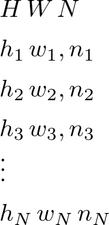
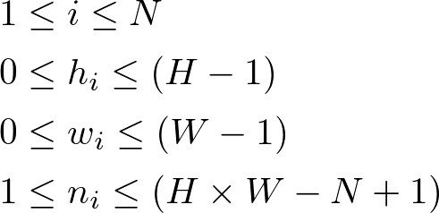

# 四角に切れ

- Tateyama3015
	- DFSのみ
- Otensho2922
	- ブロック決め打ち+DFS
- Goro2840
	- ブロック決め打ちのみ(テスト)
- Momisawa2755
	- 積集合埋め・和集合埋め

## 使い方

### Input
縦$H$マス、横$W$マス、数字が書いてあるマス目の数$N$。

0-indexedで、左から$a$マス目、上から$b$マス目に数字$c$が書いてある場合、$a\,b\,c$と表現するとする。

を満たすものとする。

