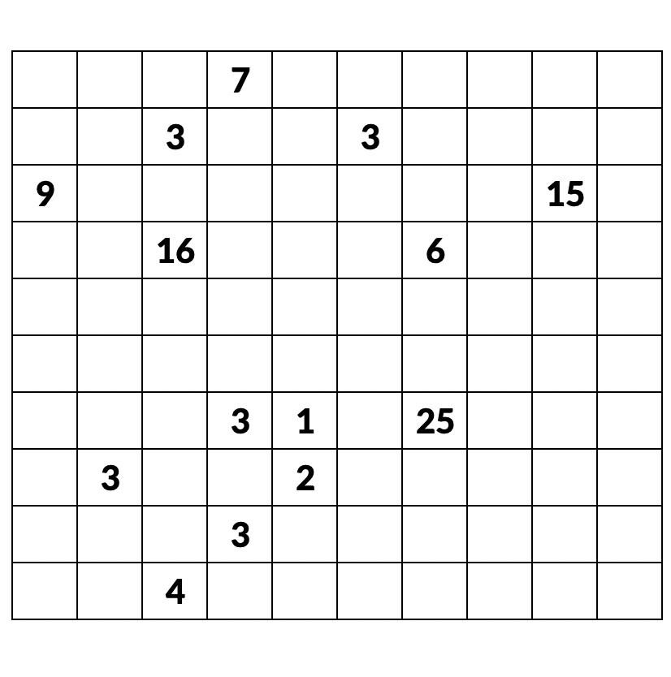

# 四角に切れ

- Tateyama3015
	- DFSのみ
- Otensho2922
	- ブロック決め打ち+DFS
- Goro2840
	- ブロック決め打ちのみ(テスト)
- Momisawa2755
	- 積集合埋め・和集合埋め

## 使い方

### Input
縦`H`マス、横`W`マス、数字が書いてあるマス目の数`N`。

0-indexedで、左から`a`​マス目、上から`b`マス目に数字`c​`が書いてある場合、`a b c​`と表現するとする。


を満たすものとする。

入力例

```
10 10 14
6 6 25
3 0 7
2 1 3
5 1 3
0 2 9
8 2 15
2 3 16
6 3 6
3 6 3
4 6 1
1 7 3
3 8 3
4 7 2
2 9 4
```




